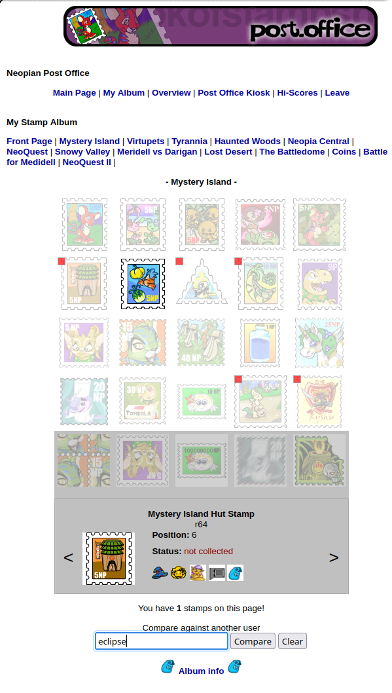

# Grundo's Café stamp album helper

This is a userscript, you can install it with the Tampermonkey browser extension.



Features:

- Fill blank album slots with images of what is missing
- Show name, rarity and description of missing stamps
- Links to searches (Shop Wizard, Trading Post, Auction House) and Jellyneo
- Compare your album progress with another user

Credits:

Modelled after the userscript [Stamp album helper](https://www.reddit.com/r/neopets/comments/ldrb2d/userscript_stamp_album_helper_i_made_this_tool/) by [u/Eat_Wooloo_As_Mutton](https://www.reddit.com/user/Eat_Wooloo_As_Mutton/) which was made for retail neo.


### Developing the script


This repository includes a Caddyfile for convenience. With caddy installed, `caddy run` can be used to host the userscript and the stamps database on `http://localhost:8080`.

The script can then be installed from `http://localhost:8080/script.user.js`

The local storage variable `stamp_database` can be set to load the script from localhost instead of the default online URL.

~~~~javascript
localStorage.setItem("stamp_database", "http://localhost:8080/stamps.json")
~~~~

Don't forget to clear it to use the default online URL again.
~~~~javascript
localStorage.removeItem("stamp_database")
~~~~


### Adding a new stamp album
- Add a new entry to `stamps.json`
- Increment the minor version in `script.user.js`

### Getting the information 

The information can be retrieved from various places

- Jellyneo (if the album is the identical on retail)
- Stamp albums of users
- Site searches

Below is a script that can be used in the browser console on Jellyneo to retrieve album information.


1. Visit the [Jellyneo Item DB Page](https://items.jellyneo.net/search/?album=15&sort=6) for the album to get info on
2. Open the first stamp
3. Open a browser console (Ctrl + Shift + I in Firefox)
4. Paste the script below and Enter
5. Right click the array that is printed to the console and press 'Copy Object'
6. Paste it in stamps.json
7. Repeat for other stamps
8. Format stamps.json


```javascript
(function(){
  let name = document.querySelector('h1').textContent
  let rarity = parseInt(document.querySelector(`[class^='rarity-label']`).previousSibling.textContent.trim().split('r')[1])
  let description = document.querySelector("div > p > em").textContent
  let img = document.querySelector(`a[href*='images.neopets']`).href.split('/items/')[1]
  return [name,rarity,description,img]
})()
```